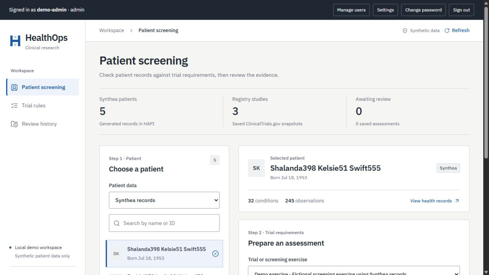
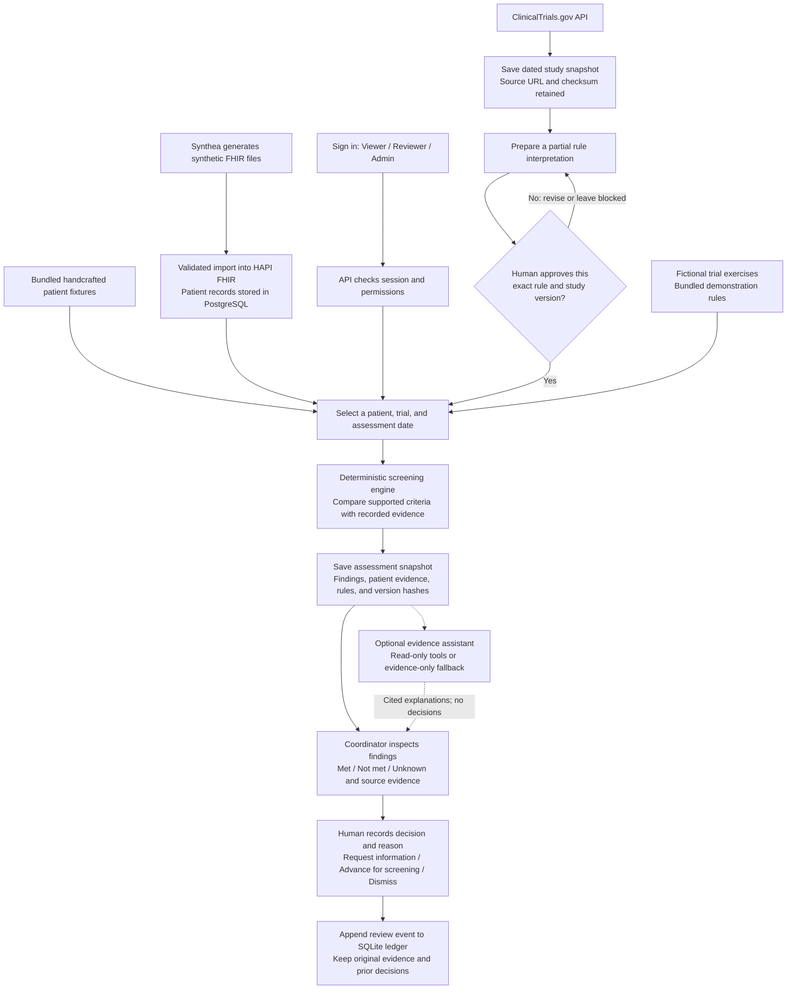

# HealthOps AI

[](https://github.com/shshakib/healthops-ai/actions/workflows/checks.yml)

**v0.1.0 · Local prototype**

A clinical-trial prescreening workbench portfolio project. The workflow is:
read synthetic patient records, compare selected trial criteria, show evidence and
unknowns, then let a human record the next screening step.

**Current capabilities:** a working dashboard, reproducible Synthea pipeline,
real registry snapshots, authenticated human review, role permissions, local MLflow
tracing, regression evaluation, and optional Ollama/OpenAI/Claude/Gemini assistance.
The verified local demo generated five patients in HAPI; a fresh checkout starts with
an empty FHIR database and also offers bundled handcrafted fixtures. Three
actual ClinicalTrials.gov snapshots are available offline, with partial rule drafts
awaiting human approval. The two fictional exercises remain available. Registry
screening requires explicit interpretation approval and keeps unmodeled criteria
visible for manual review. The synthetic example assessment date is **2026-09-01**.

Original code is licensed under [MIT](LICENSE). See [third-party notices](THIRD_PARTY_NOTICES.md)
for public registry records and upstream dependencies.

## Interface preview



*Actual local interface with imported Synthea patients and a fictional screening
exercise, captured September 14, 2026. Counts reflect that demonstration workspace;
a fresh checkout starts with an empty HAPI database. All patients shown are synthetic.*

## What happens from data to a human decision

HealthOps compares a selected patient's recorded evidence with a limited set of
trial requirements. It shows **met**, **not met**, or **unknown** for each requirement,
preserves the evidence used, and lets a human record the next screening step.



1. **Prepare the inputs.** Import generated patient records, or use the small bundled
   fixtures. Actual registry trials use saved snapshots and separately reviewed rule
   interpretations; fictional exercises are available immediately.
   Registry screenings require HAPI-backed patients; handcrafted patient fixtures
   pair with their own fictional trial exercise.
2. **Screen and inspect.** The engine evaluates supported criteria and saves the exact
   evidence used. Missing or stale evidence stays unknown. Actual registry assessments
   also retain a mandatory full-eligibility requirement for manual review.
3. **Ask for an explanation, optionally.** Ollama, OpenAI, Claude, or Gemini can select
   evidence through restricted tools. The server assembles answers from saved findings.
   This step also works in explicitly labeled evidence-only mode without an LLM.
4. **Record a human decision.** The coordinator reviews the evidence and records a
   reason. Advancing means further human screening; the program does not contact
   patients, establish clinical eligibility, or enroll anyone. Updated interpretations
   produce new assessments rather than rewriting earlier evidence and decisions.

## Start all three services with Docker

With Docker Desktop's Linux engine running:

```powershell
docker compose up --build -d --wait --wait-timeout 600
```

Create your first administrator (the command prompts for a password):

```powershell
docker compose exec healthops python -m healthops.auth admin
```

Open [the HealthOps dashboard](http://127.0.0.1:18000/) and sign in.
HAPI FHIR and PostgreSQL run on the internal Docker network. Named volumes preserve FHIR records and review history.

The dashboard provides patient selection, health records, trial-rule review,
screening evidence, and a decision ledger. See [the dashboard guide](docs/dashboard.md).
[Swagger API documentation](http://127.0.0.1:18000/docs) remains available.

```powershell
docker compose exec -T healthops python scripts/check_stack.py
docker compose exec healthops python scripts/demo.py
docker compose down
```

Normal `down` preserves records. See [the Docker guide](docs/docker.md) for ports,
storage, startup checks, and troubleshooting. For a new installation, follow
[the Synthea pipeline guide](docs/synthea.md) to generate and import records.
In this workspace, five Synthea patients are already imported:
[list them through HealthOps](http://127.0.0.1:18000/api/v1/patients?source=hapi).

The image includes [three real registry snapshots](http://127.0.0.1:18000/api/v1/trials?source=registry).
See [the trial interpretation guide](docs/trials.md) to inspect source text, review
draft criteria, and use the separate patient-screening review flow.

## Start locally (Windows PowerShell)

Use Python 3.11 or newer. This alternative runs only HealthOps directly; no Docker,
cloud account, or API key is needed for the bundled-fixture workflow.

```powershell
python -m venv .venv
& '.\.venv\Scripts\python.exe' -m pip install -c requirements-dev.lock -e '.[dev]'
& '.\.venv\Scripts\python.exe' -m healthops.auth admin
& '.\.venv\Scripts\python.exe' -m healthops
```

Open [the interactive API page](http://127.0.0.1:8000/docs). Build the frontend as
described in the dashboard guide to also serve the React interface at `/`.
The Swagger documentation UI loads
Swagger assets from a CDN; the API itself operates without an external data service.
Stop the server with Ctrl+C.

Create the first administrator once per database. For later starts, only the last command is needed. In this workspace,
Python 3.11 was selected explicitly; other computers can use their installed Python.
`requirements-dev.lock` pins the application and test dependencies used for the
verified Python 3.11 setup; it is a pip constraints file, not a lock for build tools.

With the server running, open a second PowerShell terminal in this project and run:

```powershell
& '.\.venv\Scripts\python.exe' scripts/demo.py
```

This checks all three screening outcomes, saves a clearly labeled simulated review,
and verifies that a stale review cannot overwrite it. Each run adds three synthetic
screenings and one smoke-test review to the local ledger.

## Try the human-review flow

Sign in through the dashboard as a Reviewer or Admin, then open `/docs`.
Keep `X-HealthOps-Request` set to `1` for mutations.

1. Open `POST /api/v1/screenings`, select **Try it out**, and execute the default
   request (`demo-001`, `DEMO-T2D-001`, `2026-09-01`). Copy the returned `id`.
2. Inspect the criteria, evidence references, source snapshot, and
   `review_status: pending_review`. No candidate is advanced automatically.
3. Open `POST /api/v1/screenings/{screening_id}/reviews`, paste that ID, and submit:

```json
{
  "decision": "advance_for_screening",
  "reason": "Reviewed the fictional criteria and evidence; proceed to further screening.",
  "expected_revision": 0
}
```

4. Fetch `GET /api/v1/screenings/{screening_id}` to inspect the recorded review.
   Additional reviews use the latest returned `revision`, preserving earlier events.
5. Repeat with `demo-002` for a stale lab (`unknown`) and `demo-003` for a result
   outside the fictional range (`not_met`). Try `request_information` or `dismiss`.

Advancing means further human screening. It does not establish eligibility, enroll
someone, or contact anybody. The original screening result stays unchanged when a
review is recorded. Unknowns remain visible, even when a reviewer advances a case.

## What exists today

- Deterministic age, documented-condition, and recent-lab comparisons.
- `met`, `not_met`, and `unknown` with resource references.
- Snapshot hashes, rules version, and the original input stored with each screening.
- Human review decisions with reasons, timestamps, revision checks, and history.
- Local SQLite persistence under `.local/` (excluded from Git).
- Behavior tests and lint configuration.
- A Dockerfile and Compose setup for HealthOps, HAPI FHIR R4, and PostgreSQL.
- A pinned Synthea generator, raw-file manifest, validated import, and repeat-import check.
- HAPI patient/evidence retrieval and explicit `source=hapi` screening with human review.
- Versioned ClinicalTrials.gov snapshots with source links, retrieval dates, and offline access.
- Sourced partial interpretations, separate approval/rejection, and conservative exclusion logic.

**Login and permissions:** Viewer reads records and asks the assistant; Reviewer
also runs screenings and records decisions; Admin also manages users and AI settings.
See [the login guide](docs/authentication.md) for setup, the role matrix, session
behavior, maintenance access, and tests. There are no default credentials.

**Boundaries:** the service is a local synthetic-data prototype. The APIs require
login, while `/health` and the login page are public. New review identities come
from the session; earlier self-reported labels remain explicitly unverified.
The ledger is not tamper-proof. Full FHIR profile validation, tenant isolation,
enterprise SSO, and production deployment are not implemented.

The [evidence assistant](docs/assistant.md) now explains saved findings and unknowns
in the dashboard. Administrators can use **Model connection settings** for Ollama, OpenAI, Claude,
and Gemini, with provider/model selection and server-session API keys. All use
read-only tools; the default evidence-only mode works without a model. A real LLM still needs selection and live
verification. [MLflow monitoring and evaluation](docs/evaluation.md) are implemented;
the [measured offline report](docs/evaluation/report.md) separates deterministic
checks from model quality. Cloud deployment remains future work.
HAPI uses PostgreSQL; HealthOps retains SQLite for its
review ledger until the separate application-database migration.

## Checks

```powershell
& '.\.venv\Scripts\python.exe' -m pytest -q
& '.\.venv\Scripts\python.exe' -m ruff check .
& '.\.venv\Scripts\python.exe' -m ruff format --check .
```

See [the project brief](docs/project-brief.md) for scope and
[the milestones](docs/milestones.md) for acceptance criteria and next steps.
See [the current checkpoint](docs/current-state.md) to resume after an interruption.
