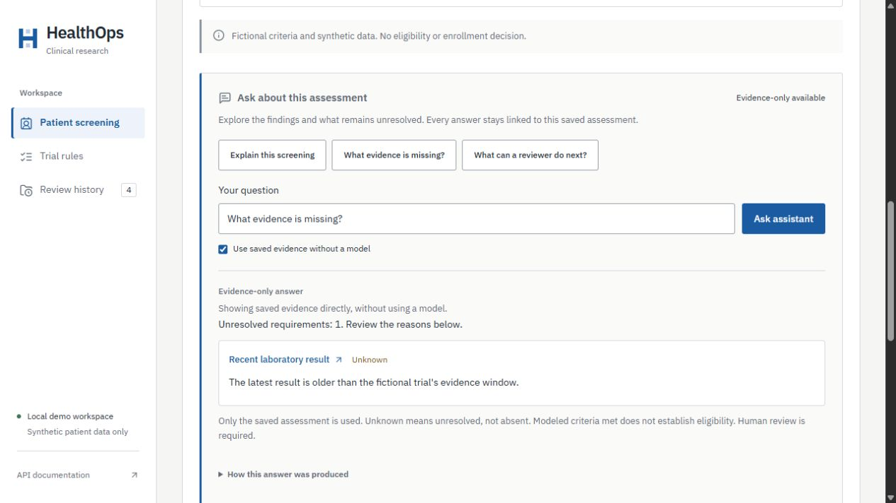
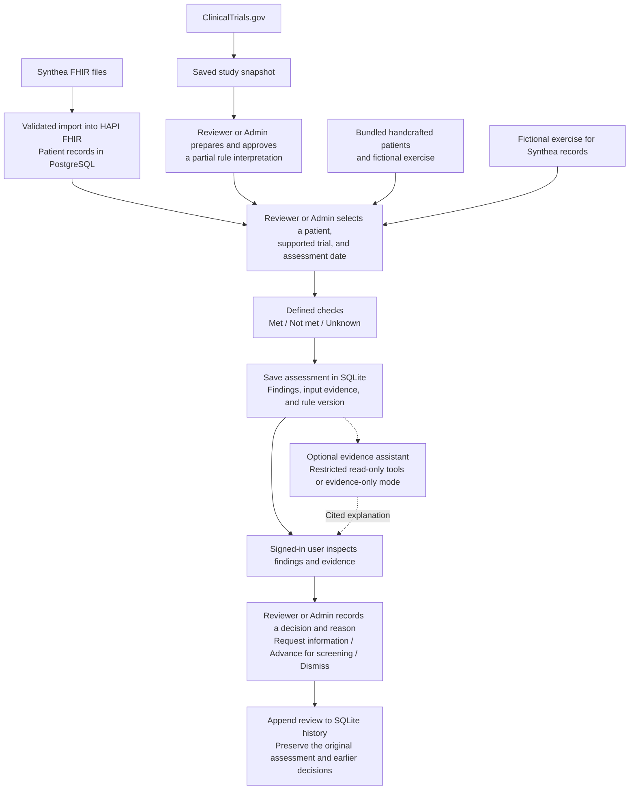

# HealthOps AI

[](https://github.com/shshakib/HealthOps-AI/actions/workflows/checks.yml)

HealthOps helps a research coordinator check whether a patient might be a fit for
a clinical trial. You select a patient and a trial, and it compares the patient's
records with the trial rules it can check. For each requirement, it shows
**met**, **not met**, or **unknown** (not enough information), along with the
evidence behind the result.

The reviewer then decides what to do next: request more information, move the case
forward for further screening, or dismiss it. HealthOps saves that decision and
the reason, so someone can come back later and see what was checked and why the
decision was made. That is where this workflow ends; it does not enroll patients.

**AI assistance is optional.** The checks themselves use code and defined rules.
The assistant helps answer questions about a saved assessment, such as "Why is
this requirement marked unknown?" It uses restricted tools to find the relevant
saved evidence, and the app builds an answer with references you can check.
The reviewer still makes the decision. The app also works without an AI model.

The project runs locally and uses **synthetic patient records**. It checks a
limited set of requirements, so a possible match still needs a full human review.

## A simple example

Imagine you're reviewing a patient for a diabetes study. Their age and recorded
diagnosis meet the rules, but their latest blood test is too old to check another
requirement. HealthOps shows those first two results as **met** and the blood-test
requirement as **unknown**, with the record and date behind each finding.

You can ask the assistant why the result is unknown, inspect the evidence, then
choose **Request information** and record that a more recent test result is needed.
The assessment and your reason are saved in the review history. Try this scenario
with fictional patient `demo-002`, trial `DEMO-T2D-001`, and date `2026-09-01`.

## Interface preview


*Patient selection in the refreshed interface, using copied Synthea records in an
isolated demonstration workspace.*



*The evidence-only assistant explains why a saved requirement is unknown. Both
screenshots were captured on September 24, 2026; all patients shown are synthetic.*

For a detailed tour, [watch the complete walkthrough (13 minutes, with captions)](https://github.com/shshakib/HealthOps-AI/releases/download/v0.2.0/healthops-full-demo.mp4).
It covers the architecture, login and permissions, settings, trial rules, screening,
and human review. [Recording details and narration](docs/demo/video-one.md).

## How it works

There are two input paths: imported Synthea records with reviewed registry rules
or a fictional exercise, and bundled handcrafted patients with their own exercise.
Actual registry trials require approval of the exact study snapshot and rule version.



The API checks the session and permissions on each request. **Viewers** can read
records and ask the assistant. **Reviewers** can also run screenings, approve trial
interpretations, and record decisions. **Admins** also manage users and AI settings.

Registry screening requires a HAPI-backed patient and approved rules matching the
current study snapshot. Unsupported requirements remain visible for manual review;
missing or stale evidence stays unknown. Approving a rule interpretation and
reviewing a patient's assessment are separate actions.

## What runs where

| Part | Technology | Purpose |
|---|---|---|
| Dashboard and application API | React, Vite, Python, FastAPI | Screening, evidence, accounts, and review workflow |
| Patient-record service | HAPI FHIR R4 + PostgreSQL | Store and serve imported synthetic FHIR records |
| Application database | SQLite | Accounts, sessions, trial-rule reviews, assessment snapshots, and decision history |
| Optional assistant | OpenAI, Claude, Gemini, or Ollama | Select saved evidence through restricted tools; cannot submit decisions |
| Monitoring and evaluation | MLflow + Python evaluation cases | Record operational metadata and check assistant behavior |
| Local deployment and checks | Docker Compose + GitHub Actions | Run the services; test code, browser flows, and secret handling |

The standard Docker setup has three services: HealthOps, HAPI, and PostgreSQL.
Synthea runs as a temporary data-generation container. The MLflow UI is an optional
monitoring service. Azure, Databricks, and Snowflake are future extensions.

## Run with Docker

From a checkout of this repository, with Docker Desktop's Linux engine running:

```powershell
docker compose up --build -d --wait --wait-timeout 600
docker compose exec healthops python -m healthops.auth admin
```

The second command prompts for the first administrator's password. Run it once
per database; there are no default application credentials.

Open [the dashboard](http://127.0.0.1:18000/) and sign in. A fresh installation has
an empty HAPI database, but the **Handcrafted demo fixtures** workflow is ready to
use. Three saved ClinicalTrials.gov snapshots are included; registry screening
needs imported patients and an approved interpretation.

1. Choose **Handcrafted demo fixtures**, patient `demo-002`, and the fictional trial.
2. Use assessment date `2026-09-01`, then run screening.
3. Inspect the findings and optionally ask what evidence is missing.
4. Record a next step and reason, then reopen the assessment in **Review history**.

To use generated patients, follow the [Synthea generation and import guide](docs/synthea.md).
For optional model access, Admins use **Settings → AI configuration**.
[Model setup, API keys, and evidence-only mode](docs/assistant.md).

HAPI and PostgreSQL stay on the internal Docker network. Named volumes preserve
the databases across normal restarts and `docker compose down`.
See [Docker setup and troubleshooting](docs/docker.md), or
[run directly with Python on Windows](docs/dashboard.md#run-directly-with-python-windows-powershell).
After signing in, [API documentation](http://127.0.0.1:18000/docs) is available on
the same host. [API review example](docs/dashboard.md#try-the-review-flow-through-the-api).

## Evaluation and limits

The OpenAI `gpt-5.4-mini` assistant passed **23/24 fresh synthetic questions** on
its first run. A prompt experiment passed 21/24 and was rejected; both results
and their failures are preserved in the [fresh evaluation report](docs/evaluation/fresh/README.md).
An earlier **22/22 regression run** is documented separately in the
[live evaluation report](docs/evaluation/live/README.md). These are small,
author-prepared software evaluations, not clinical validation or independent benchmarks.
Other provider adapters have protocol tests but no published live evaluation.

The assistant uses saved assessment evidence, not an unrestricted medical chatbot
or a document-vector search system. It cannot change records, approve rules,
submit a review, or enroll a patient. [Tools and fallback behavior](docs/assistant.md).

This is a local synthetic-data application. It does not provide enterprise SSO,
patient-level access restrictions, tenant isolation, or a production deployment.
The local ledger is not tamper-proof. [Account and permission details](docs/authentication.md).

## Project structure

| Location | Contents |
|---|---|
| `src/healthops/` | Python API, screening rules, authentication, storage, and assistant |
| `frontend/` | React interface and browser tests |
| `data/` | Public trial snapshots and synthetic evaluation datasets |
| `tests/` | Python behavior and integration tests |
| `scripts/` | Local checks, fixture servers, and media-production helpers |
| `infrastructure/` | Synthea generator Dockerfile |
| `docs/` | Setup guides, evaluation evidence, design notes, and recording scripts |
| `.github/workflows/` | Automated tests, builds, offline evaluation, and secret scan |

Generated patient exports, databases, credentials, videos, and build output are
excluded from Git. Published videos are release assets. Historical evaluation
reports and rejected experiments are retained so the results remain inspectable.

For setup details and further reading, use the [documentation index](docs/README.md).

## Checks

With the Python development environment installed:

```powershell
& '.\.venv\Scripts\python.exe' -m pytest -q
& '.\.venv\Scripts\python.exe' -m ruff check .
& '.\.venv\Scripts\python.exe' -m ruff format --check .
```

Frontend build and browser-test instructions are in the [dashboard guide](docs/dashboard.md#checks).
[GitHub Actions](docs/ci.md) runs these checks and offline evaluation without model API keys.

Original code is licensed under [MIT](LICENSE). See [third-party notices](THIRD_PARTY_NOTICES.md)
for public registry records, fonts, and upstream dependencies.
